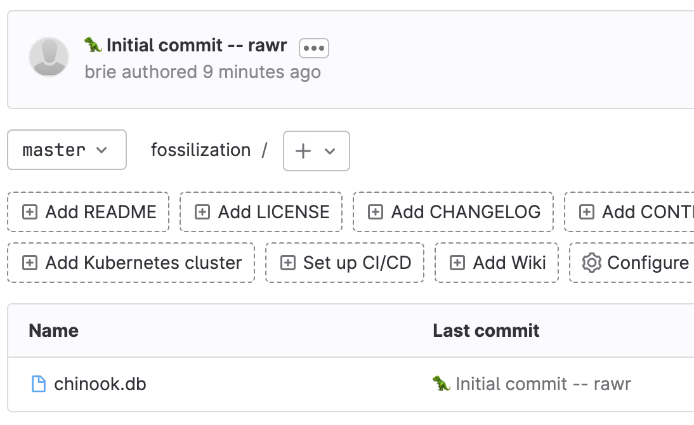

# Use fossil to automatically push to git

The Fossil docs have a guide on [mirroring a Fossil repository](https://www.fossil-scm.org/home/doc/trunk/www/mirrortogithub.md) with GitHub. First things first: [fossil](https://www.fossil-scm.org/home/doc/trunk/www/index.wiki) offers SQLite-based distributed version control and a bunch of other cool features. I followed the guide to get the `git export` functionality working. I build on the guide by:

  - mirroring with GitLab
    - You can use Gitea, Codeberg, sr.ht, whatever!
  - using SSH rather than HTTPS
  - taking a quick tour around some cool `fossil` features

## TL;DR

In this guide we build towards getting this command to work:

```
fossil git export ../gitdir   --autopush     git@gitlab.com:brie/fossilization.git
```

As you may have guessed, this will export the `fossil` repository for use with `git`, push it automatically to a GitLab rep via SSH. 

In order to follow along:

```
mkdir -p ~/gitfossils/fossildir/ ~/gitfossils/gitdir
```

## Fossil Setup

```
cd ~/gitfossils/fossildir
fossil init cats.fossil
```

You'll see output like:

```
project-id: 1dd82519a5ee932135667692bf5806442a90ff1c
server-id:  c2218150ae99d03aa7cbb607591c184cdeb71f6d
admin-user: brie (initial password is "WHATEVER")
```

```
fossil open cats.fossil
```

If all goes well, you'll get some metadata about your project/repo.

Copy some files into `~/gitfossils/fossildir` (Markdown, cat pictures, whatever). 

This is the earliest that you can copy files into  `~/gitfossils/fossildir`. Any earlier and you'll get error messages. See the **Appendix B**. 

Let's add the file:

```
# fossil add plop.png
ADDED  plop.png
```

🎉 We successfully added the file! Let's commit it. Fossil accepts emoji in commit messages! A dinosaur emoji seems appropriate:

```
fossil commit -m "🦖 Initial commit -- rawr"
```

We are done with `fossil` for now.


## Git Setup

We need to set up an empty `git` repo:

```
cd ~/gitfossils/gitdir
git init .
```

## 🚀 Let's go! 

The prep work is all done! 

```
cd ~/gitfossils/fossildir
fossil git export ../gitdir   --autopush     git@gitlab.com:brie/fossilization.git
```

If all goes well, you will see familiar out put at this point:

```
Enumerating objects: 5, done.
Counting objects: 100% (5/5), done.
Delta compression using up to 16 threads
Compressing objects: 100% (3/3), done.
Writing objects: 100% (5/5), 168.76 KiB | 4.96 MiB/s, done.
Total 5 (delta 0), reused 0 (delta 0), pack-reused 0
```

## Check it out! 

Browse to the GitLab repository via the Web interface.



## What's next?

```
file cats.fossil
cats.fossil: SQLite 3.x database (Fossil repository), last written using SQLite version 3041000, file counter 26, database pages 939, cookie 0x2a, schema 4, UTF-8, version-valid-for 26
```

### Exploring the `git` repo

In `git log`, we see:

```
FossilOrigin-Name: b6301d69d9069cbdc54a1a5fa47fa46d193ad86e510cc82eec14099ab3f620aa
```

### Make some changes
Back to `fossil`, so `cd ~/gitfossils/fossildir` and let's use `fossil status`. At the end, we see that the file has been edited:

```
EDITED     plop.png
```


```
fossil diff
Index: plop.png
==================================================================
--- plop.png
+++ plop.png
cannot compute difference between binary files
```


### Explore the project
#### CLI

```
fossil timeline
=== 2023-03-11 ===
17:14:24 [b6301d69d9] *CURRENT* 🧪 Let us make some changes (user: brie tags: trunk)
16:40:02 [c34e145eb0] 🦖 Initial commit -- rawr (user: brie tags: trunk)
16:35:51 [b868ce4705] initial empty check-in (user: brie tags: trunk)
+++ no more data (3) +++
```
#### Web UI

Let's check out the Web interface:

```
fossil ui
```

At `/home`, we get a hint on how to name the project. That accepts emoji.

### Export and autopush the changes

Let's export the changes:

```
fossil git export
```

It just works! 


## 🔖 READmore

  - [Fossil](https://www.fossil-scm.org/home/doc/trunk/www/index.wiki)
  - A [fossil setup script](https://gist.github.com/dehylton/f8daa17bec33b5a1e58972675986c22f)
  - [mirroring with git from the Fossil docs](https://www.fossil-scm.org/home/doc/trunk/www/mirrortogithub.md)
  - [Exporting SQLite to Git](https://repo.or.cz/sqlite-export.git)

## Appendix A: Branch Names

The [fossil docs](https://www.fossil-scm.org/home/doc/trunk/www/mirrortogithub.md) note:

> The name of the "trunk" branch is automatically translated into "master" in the Git mirror unless you give the --mainbranch option, added in Fossil 2.14.

This did not quite work for me:

It seems I have the right version:

```
fossil version
This is fossil version 2.21 [f9aa474081] 2023-02-25 19:23:39 UTC
```

I tested putting `--mainbranch` in different places in the command because sometimes that matters:

```
➜  fossildir fossil git export ../gitdir --mainbranch  --autopush    git@gitlab.com:brie/fossilization.git
unrecognized command-line option or missing argument: --mainbranch
➜  fossildir fossil git export ../gitdir   --autopush   --mainbranch  git@gitlab.com:brie/fossilization.git
Usage: fossil git export ?MIRROR?
➜  fossildir fossil git export ../gitdir   --autopush     git@gitlab.com:brie/fossilization.git
git fast-import --export-marks=.mirror_state/marks.txt --quiet --done
2 check-ins added to the /Users/brie/gitfossils/gitdir
git update-ref "refs/heads/master" 66331175848bbc7c52241a40a7a855c613758ecf
git push --mirror git@gitlab.com:brie/fossilization.git
```

**TODO** I will update this post if I explore this and find something useful.

## Appendix B: Impatience

```
~/bin/fossil open cats.fossil
directory /Users/brie/gitfossils/fossildir is not empty
use the -f (--force) option to override
or the -k (--keep) option to keep local files unchanged
```
